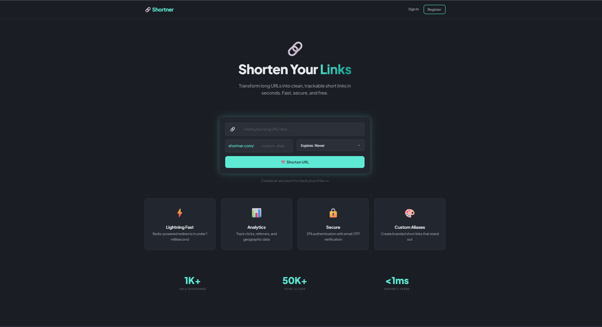
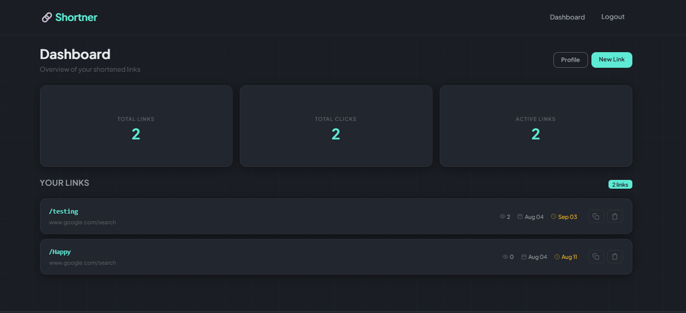
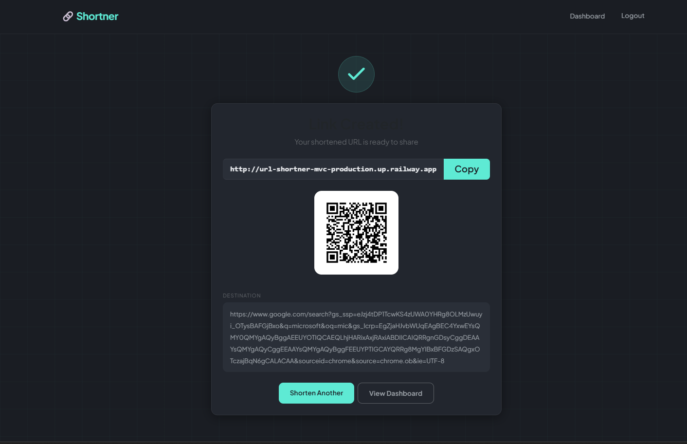

<h1>🔗 URL Shortner</h1>

  
  
  
  
  
  
  

<i>A production-ready URL shortener with analytics, built with Clean Architecture</i>

 

<h2>📸 Preview</h2>

  
  

<h2>✨ Features</h2>

<table>
  <tr>
    <td width="50%">
      <h3>🔗 URL Shortening</h3>
      
Create short URLs with optional custom aliases. Auto-generates 7-character codes or use your own branded link.

    </td>
    <td width="50%">
      <h3>⚡ Lightning Fast</h3>
      
Redis caching delivers sub-millisecond redirects. Rate limiting protects against abuse.

    </td>
  </tr>
  <tr>
    <td>
      <h3>🔐 Secure Auth</h3>
      
Email + Password with OTP verification. JWT tokens with automatic refresh rotation. Account lockout after 5 failed attempts.

    </td>
    <td>
      <h3>📊 Analytics Dashboard</h3>
      
Track every click. See total links, click counts, and manage your URLs from one dashboard.

    </td>
  </tr>
  <tr>
    <td>
      <h3>📱 QR Codes</h3>
      
Every short link gets a downloadable QR code. Perfect for sharing on print or social media.

    </td>
    <td>
      <h3>⏱ URL Expiry</h3>
      
Set links to expire in 1, 7, 30, or 90 days. Expired links automatically return 404.

    </td>
  </tr>
</table>

<h2>🏗️ Architecture</h2>

<pre><code>src/
├── UrlShortner.Domain/          → Entities &amp; Interfaces
├── UrlShortner.Application/     → Business Logic &amp; Services  
├── UrlShortner.Infrastructure/  → Data Access, Redis, Email
└── UrlShortner.Web/            → MVC Controllers &amp; Views</code></pre>

<b>Clean Architecture</b> with 4 layers. Domain knows nothing about databases or UI. Infrastructure implements what Domain defines.

<h2>🛠️ Tech Stack</h2>

<table>
  <tr><th>Layer</th><th>Technology</th></tr>
  <tr><td><b>Framework</b></td><td>ASP.NET Core MVC (.NET 10)</td></tr>
  <tr><td><b>Database</b></td><td>SQL Server + PostgreSQL (dual support)</td></tr>
  <tr><td><b>ORM</b></td><td>Dapper</td></tr>
  <tr><td><b>Cache</b></td><td>Redis (Upstash)</td></tr>
  <tr><td><b>Auth</b></td><td>JWT + Refresh Tokens + OTP</td></tr>
  <tr><td><b>Email</b></td><td>MailKit (Brevo/Gmail SMTP)</td></tr>
  <tr><td><b>Frontend</b></td><td>Razor Views + Bootstrap 5</td></tr>
  <tr><td><b>Testing</b></td><td>xUnit + Moq + FluentAssertions</td></tr>
  <tr><td><b>Infra</b></td><td>Docker + Railway + Supabase</td></tr>
</table>

<h2>🚀 Quick Start</h2>

<pre><code># Clone the repo
git clone https://github.com/XPSTARTS/Url-Shortner-MVC.git
cd Url-Shortner-MVC

# Start SQL Server &amp; Redis
docker-compose up -d

# Run database migrations
# Connect to SQL Server and run database/init.sql

# Start the app
dotnet run --project src/UrlShortner.Web</code></pre>

Open <code>https://localhost:7257</code> in your browser.

<blockquote>💡 OTP codes appear in the console during development. No email setup needed.</blockquote>

<h2>🔐 Authentication Flow</h2>

<pre><code>Register → Email + Password → OTP → Verify → Account Created
Login    → Email + Password → OTP → Verify → JWT + Refresh Token
Request  → JWT Cookie → Auto-refresh if expired → Continue</code></pre>

<ul>
  <li><b>Access Token:</b> 15 minutes (JWT, HTTP-only cookie)</li>
  <li><b>Refresh Token:</b> 7 days (opaque, stored in DB + Redis)</li>
  <li><b>OTP:</b> 6 digits, expires in 10 minutes (Redis)</li>
</ul>

<h2>📊 Tests</h2>

<pre><code>✅ 28 Unit Tests (Services, Validators, Helpers)
✅ 12 Integration Tests (Repositories, Redis, Database)
━━━━━━━━━━━━━━━━━━━━━━━━━━━━━━━━━━━━━━━
✅ 40 Total Tests Passing</code></pre>

Run with:

<pre><code>dotnet test</code></pre>

<h2>🎯 API Endpoints</h2>

<table>
  <tr><th>Method</th><th>Path</th><th>Auth</th><th>Description</th></tr>
  <tr><td><code>POST</code></td><td><code>/Url/Create</code></td><td>Optional</td><td>Shorten a URL</td></tr>
  <tr><td><code>GET</code></td><td><code>/{shortCode}</code></td><td>No</td><td>Redirect to original URL</td></tr>
  <tr><td><code>POST</code></td><td><code>/Auth/Register</code></td><td>No</td><td>Create account</td></tr>
  <tr><td><code>POST</code></td><td><code>/Auth/Login</code></td><td>No</td><td>Sign in</td></tr>
  <tr><td><code>POST</code></td><td><code>/Auth/VerifyOtp</code></td><td>No</td><td>Verify OTP</td></tr>
  <tr><td><code>GET</code></td><td><code>/Dashboard</code></td><td>JWT</td><td>User dashboard</td></tr>
  <tr><td><code>GET</code></td><td><code>/Dashboard/Profile</code></td><td>JWT</td><td>Profile + stats</td></tr>
</table>

<h2>🌐 Live Demo</h2>

<b><a href="https://url-shortner-mvc-production.up.railway.app">https://url-shortner-mvc-production.up.railway.app</a></b>

<blockquote>Note: Email delivery is unavailable in the demo. OTP codes are displayed on-screen.</blockquote>

<h2>📝 License</h2>

MIT — feel free to use, modify, and learn from this project.

  Built with ☕ and late nights

